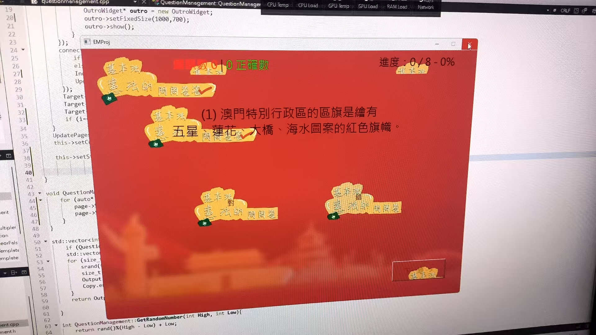

## 歷史

### 問答游戲設計比賽
記得那是2024年9月初，當時品德科老師要我們做一個關於「基本法和憲法」的問答游戲，不僅作為一個測驗，也作為一次參與游戲設計比賽的機會。  
我感到很興奮，因為我在暑假學的Qt終於有用武之地了。  
於是我便用了一個多月，不斷調整游戲内功能（順帶學習更多Qt的知識和壓榨同組成員要素材），終於在10月初完成了這個游戲。 
> 
> 當時發現一個比較嚴重的顯示BUG

當時我未發現GitHub的存在，所以我一直使用USB來傳輸游戲程式碼。  

後來在把游戲上交到學校的時候，我才發現原來有GitHub這個東西。  
於是我便把這個游戲上傳到GitHub。[鏈接](https://github.com/hwc20896/Moral-Education-Project---Game-Design)

這次的游戲設計比賽，我們組獲得了第四名，並獲得在2024年學校開放日向公眾展覽的機會。

### 中國文化知識問答游戲？
大概在2024年10月下旬，問答游戲在向中學生展覽時被中文科老師看中，她想要我在12月的開放日前做一個關於中國文化的問答游戲。  
我本來想要直接把原來游戲的代碼複製到中國文化問答游戲，但後來發現這樣做會有很多問題。